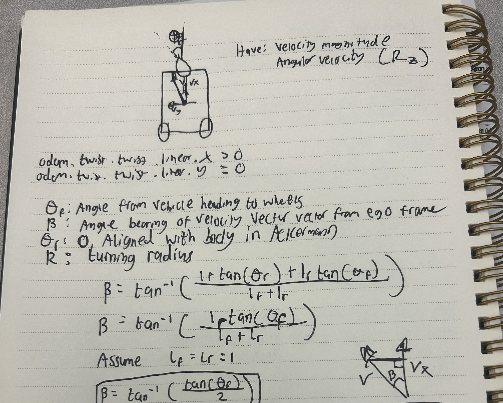

# Lab 2: Automatic Emergency Braking

### Deliverable 2: Emergency Breaking No Turning:

https://youtu.be/bE42q3OxTn4

Implementation Details:

* When moving forward and not turning, we simply will only look at the center beam (different when turning)
* I decided to use a look ahead for each lidar beam to compute r dot
* I compute r dot as the difference between the projection and the current range, projections that are closer to the wall are negative and ones that are further away are positive

### Deliverable 3: Emergency Breaking with Turning:
https://youtu.be/ZOfSu3-gkys

Implementation Details:

* I used the bicycle kinematic model in order to calculate the velocities in the x and y direction by finding the bearing
* Found the bearing via the attached screenshot
* I looked at the velocity in the y direction, if it was negative i would consider beams to the right of the car and beams at the left of the car if the y velocity was positive. Moving straight still just yielded the center beam. See code for more details

Derivation from bicycle model:

Assumtions:

* Took the length from the center of mass to the front and rear to be 1
* Did not assume steering angle was given, calculated it by: $$\frac{L * \omega}{v}$$

where v is the speed $\omega$ is the angular velocity of the car and $L$ is the distance from the rear wheel to the front wheel/